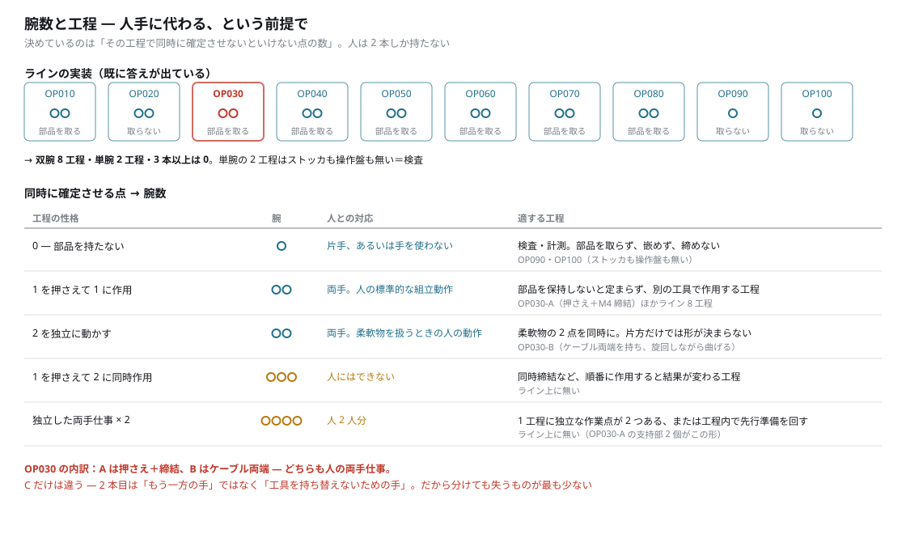

# 腕数と工程の対応 — 人手に代わる、という前提で

2026-09-12。利用者の指示による。**寸法は詰めない。工程との適合だけを見る。**

```
python3 scripts/check_op030_v07c_arms_by_process.py
python3 scripts/draw_op030_v07c_arms_by_process.py
```



---

## 0. 前提を置き換えた

前回までは「何本あれば速いか」で見ていた。**「人手に代わる」なら軸が変わる:**

> **その工程で、同時に確定させないといけない点はいくつあるか。**
> **人は 2 本しか持たない。**

---

## 1. ラインは既に答えを出している（実測）

| | 腕 | ストッカ | 操作盤 |
|---|---|---|---|
| OP010〜OP080 | **2** | 有（OP020 のみ無し）| 有 |
| **OP090・OP100** | **1** | **—** | **—** |

- **双腕 8 工程・単腕 2 工程・3 本以上は 0 工程**
- **単腕の 2 工程は、ストッカも操作盤も無い**＝部品を取らない＝**検査**
- 概念図の「最終 2 工程（検査）は治具なしで旋回もストッカも無し」と一致する

⇒ **「部品を取って嵌める」＝双腕、「見るだけ」＝単腕。** これがラインの既定値である。

---

## 2. 同時に確定させる点 → 腕数

| 工程の性格 | 腕 | 人との対応 | 適する工程 | ライン |
|---|---|---|---|---|
| **0 — 部品を持たない** | **1** | 片手、あるいは手を使わない | 検査・計測。取らず、嵌めず、締めない | OP090・OP100 |
| **1 を押さえて 1 に作用** | **2** | 両手。人の標準的な組立動作 | 保持しないと定まらず、別の工具で作用する | OP030-A ほか 8 工程 |
| **2 を独立に動かす** | **2** | 両手。柔軟物を扱うときの動作 | 柔軟物の 2 点を同時に。片方だけでは形が決まらない | OP030-B |
| **1 を押さえて 2 に同時作用** | **3** | **人にはできない** | 同時締結など、順番に作用すると結果が変わる工程 | **無し** |
| **独立した両手仕事 × 2** | **4** | **人 2 人分** | 1 工程に独立な作業点が 2 つ／工程内で先行準備を回す | **無し** |

**上 3 行は人の形。下 2 行は人の形ではない。**
⇒ **3 本・4 本は「人手の置き換え」では正当化されない。** 並列化で正当化するしかない。

---

## 2.5 「A と B だけが両腕を要る」のか — **いいえ**

⚠ **設備タグが 2 本であることと、2 本必要であることは別。** authored なシーケンスが
committed にある工程だけが検証できる。

| 工程 | 2 本必要か | 根拠 |
|---|---|---|
| OP010 | **未検証** | authoring スクリプトが committed に無い |
| **OP020** | **要る** | **右腕がトレイの取っ手を 68 秒中 63 秒（93%）保持、左腕が作業。**ヨークも 180° 旋回（t 5–13、54–62）|
| **OP030-A** | **要る** | 押さえたまま締結 |
| **OP030-B** | **要る** | 同一ケーブルの両端 |
| **OP030-C** | **要らない** | M6 と M14 を直列 |
| OP040〜OP080 | **未検証** | 設備タグは 2 本。動作は「大まかなもののみ」（CHECKPOINT）|
| OP090・OP100 | 1 本 | 実装が 1 本。部品を取らない |

⇒ **検証できた 4 工程のうち 3 つが両手を要し、C だけが例外である。**
**OP020 は OP030-A と同じ形**（片腕が保持し続け、もう片腕が作業し、ヨークが旋回する）。

⇒ **「A と B だけ」ではなく、「両手が既定で、C が外れ値」**と読むのが正しい。

---

## 3. OP030 の 3 工程の当てはまり

| | 何をしているか | 人なら | 腕数 |
|---|---|---|---|
| **A** | 片手で供給から運び**そのまま押さえる**、もう片手が締結 | **両手仕事そのもの** | 2 |
| **B** | **両手で同一ケーブルの両端**。旋回しながら曲げる | **両手仕事そのもの** | 2 |
| **C** | M6 と M14 を別腕に載せ、端子は**直列** | **工具を持ち替える片手仕事** | 1 |

**C だけが違う。** 2 本目は「もう一方の手」ではなく **「工具を持ち替えないための手」**である。

⇒ **C は対を分けても失うものが最も少ない。**（前回の結論と一致するが、理由がはっきりした）

**A の旋回は人の「腰をひねって背後の部品を取る」動作**である。だから
2 本を載せたヨークごと回る（軸が 1 本）。**人の形をそのままモデル化している。**

---

## 4. 工程の性格から見た使い分け（推論）

**事実は §1〜§3。ここからは読み。**

### 単腕が向く
- **部品を持たない工程**（検査・計測・マーキング）
- **部品が自立する / 治具が保持を肩代わりする工程**
- **工具が 1 種類、または 1 台に複数工具**（利用者の制約 3 がこれ）
- ⚠ **A・B を単腕にするには保持治具が要り、制約 2 に抵触する**

### 双腕が向く
- **保持しないと部品が定まらない工程**（＝ほとんどの組立）
- **柔軟物の 2 点を同時に扱う工程**（B。これは還元不能）
- **背面供給から取る工程**（腰の旋回が効く）
- **ラインの 8 割がこれ。既定値として妥当。**

### 3 腕が向く
- **順番に作用すると結果が変わる工程** — 同時締結（片締めによる歪み・緩み）
- 押さえ＋作用＋**計測**（作用しながら測る）
- ⚠ **人の代替ではなく、人の作業の改良。** 正当化は品質側から出す

### 4 腕が向く
- **1 工程に独立な作業点が 2 つある工程** — **OP030-A の支持部 2 個がまさにこれ**
- または **工程内パイプライン**（2 本が作業、2 本が次の部品を準備）
- ⚠ **人 2 人分。** セル 1 つに 2 人分を入れる意味があるかは、律速がその工程にあるときだけ

---

## 5. 決まらないこと

- **OP040 以降は大まかな動作のみ**（CHECKPOINT）。「8 工程が双腕」は**設備タグの実装**であって、
  **本当に両手を要するかを検証できたのは OP020 と OP030 A/B/C の 4 つだけ**（§2.5）。
  **OP010 と OP040〜OP080 は未検証**
- **3 腕・4 腕の可否は自己干渉で決まり、それは未計測**（問い f）
- 本書はタクトも到達も見ていない。**工程の性格だけで並べた**
