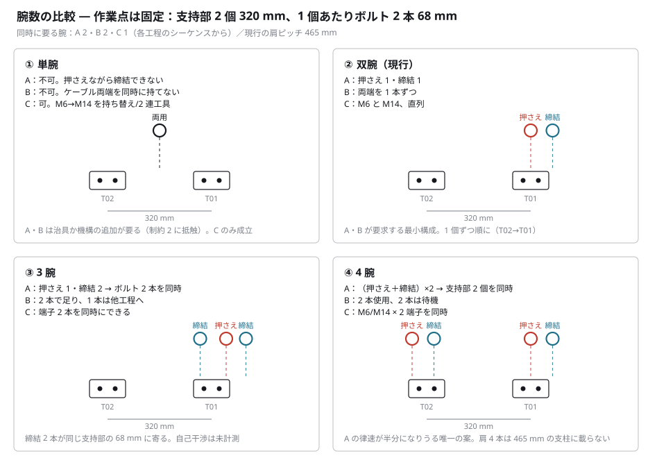
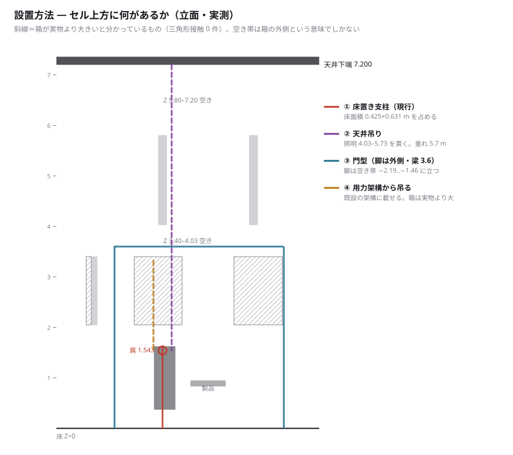

# 腕数（1・2・3・4）と設置方法の検討

2026-09-12。利用者の指示による。**制約 4「いまは単腕化ではなく双腕構成の見直し」より範囲を広げている。**

```
python3 scripts/check_op030_v07c_arm_count_and_mounting.py
python3 scripts/draw_op030_v07c_arm_count_and_mounting.py
```

`audit/op030_v07c_arm_count_and_mounting.json` /
`analysis/op030_v07c_arm_count.svg` / `analysis/op030_v07c_mounting.svg`。
**定数と占有はすべて committed ファイルから読む。**

---

## 0. 結論

| | |
|---|---|
| **腕数を決めているのは「同時性」** | A 2・B 2・C 1（各工程のシーケンスから実測）|
| **律速に効くのは 4 腕だけ** | A の支持部 2 個は**直列**。2 対にすれば片方が消える |
| **3 腕は A の律速を半分にしない** | ボルト 2 本を並列にするだけ。取得往復は残る |
| **腕数と設置方法は 2 本を超えると同じ問題** | 肩 4 本は 465 mm ピッチの支柱に載らない |
| **天井直上は空いていない** | 用力主管（〜3.32）と照明（4.03–5.73）がセルの真上を通る |
| **止めているのは自己干渉で、それは未計測** | 3 腕・4 腕の可否はここで決まる（問い f）|

---

## 1. 腕数を決めているもの＝同時性（実測）



各工程のシーケンスから、**同時に要る腕**を読んだ:

| 工程 | 同時に要る | 根拠（committed ソース）|
|---|---|---|
| **A** | **2** | 「右保持のままM4締結」。押さえながら締結する。位置決めピンの上に保持機構が無い |
| **B** | **2** | `self.state["holds"] = {0: (uid, "T"), 1: (uid, "J1")}`。**同一ケーブルの両端** |
| **C** | **1** | 工具は腕に恒久取付（`"This arm is not permanently fitted with..."`）。M6 と M14 が別腕で、端子は直列 |

**作業点の寸法**（これも committed ソースから）:

- **支持部 2 個は 320 mm 離れている**（`TERMINAL_X = (-0.16, 0.16)`）
- **1 個あたりボルト 2 本は 68 mm**（`seat = final @ pose(location=(0, sign * 0.034, 0))`）
- 現行の肩ピッチは **465.5 mm**

---

## 2. 腕数ごと

### ① 単腕

- **A・B は不可。** 押さえながら締結できず、ケーブル両端を同時に持てない
- **C のみ成立。** 利用者の制約 3 がすでにこれを挙げている（単腕 1 台に 2 つのナット締め機）
- A を単腕にするには**保持治具**が要る ⇒ **制約 2 に抵触**（案④ が却下された理由と同じ）

### ② 双腕（現行）

- **A・B が要求する最小構成。**
- **C では 1 本が遊ぶ** — 別工具を積んではいるが、端子は直列
- A は支持部を **1 個ずつ順に**（T02→T01）

### ③ 3 腕

- **A：** 押さえ 1 ＋ 締結 2 ⇒ **同じ支持部のボルト 2 本を同時に**
- **効き方は限定的。** §2.6 の内訳では、支持部 1 個 105.7 秒のうち
  締結は 39.2 秒、**取得往復が 31.7 秒**。締結だけ並列にしても取得は残る
- **締結工具 2 本が 68 mm に寄る。** 工具ソケット自体は 25 mm 角なので入るが、
  **その後ろの腕が入るかは未計測**

### ④ 4 腕

- **A：（押さえ＋締結）× 2 ⇒ 支持部 2 個を同時に。**
- **これだけが律速に効く。** A の 238.8 秒は「105.7 × 2 ＋ 段取り 26.6」で、
  **2 個が直列だから 2 倍になっている。** 対にすれば片方が消える
- **代償は据付。** 肩 4 本は **465.5 mm ピッチ・0.425 × 0.631 m の支柱**に載らない
- B は 2 本しか使わない。C は M6/M14 × 2 端子を同時にできる

---

## 3. 設置方法



**上方の占有を実測した**（セル Y 帯 −2.10〜−1.30、腕の上端 2.05 より上）:

| Z 帯 | 塞がっている X | |
|---|---|---|
| 2.05–3.40 | −2.41..−2.19（用力立管）／**−1.46..−0.51（用力主管）**／+0.51..+1.47 | **セル真上** |
| 3.40–4.03 | 空き | |
| 4.03–5.80 | **−0.98..−0.82**／+0.82..+0.98（照明）| **セル真上** |
| 5.80–7.20 | 空き | |

**天井下端は 7.200 m。** ⇒ **セルの真上（X −0.9）は、用力主管と照明の両方が通っている。**
どちらも**ライン方向に連続**（主管 20.25 m、照明 32.65 m）で、1 セルのために避けられるものではない。

⚠ **用力主管の箱は実物より大きいと分かっている**（箱候補 291 組に対し三角形接触 0 件）。
**上表の「塞」は上界であって、実際の空きは分からない。**

| 案 | 内容 | 効くところ | 代償・未確認 |
|---|---|---|---|
| **① 床置き支柱（現行）** | Z 0.370→1.626、0.425 × 0.631 m | 相対剛性が最も高い | **床面積を食う**（案② の床問題の当事者）|
| **② 天井吊り** | 7.200 から吊る | **床が完全に空く** | **照明 4.03–5.73 を貫く。垂れ 5.7 m** — B が要る相対精度に対して最悪 |
| **③ 門型** | 脚を空き帯 −2.19..−1.46 と +1.47 外に立て、梁を渡す | **コンベヤ脇の床が空く。垂れが短い** | 梁の下に主管がある。脚が供給パレットに近い |
| **④ 用力架構から吊る** | 既設の主管架構（〜3.32）に載せる | **新設構造が最小。垂れ 1.8 m** | **架構の耐荷重は model に無い。**箱が実物より大きい |

---

## 4. 2 本を超えると、腕数と設置は同じ問題になる（推論）

**ここからは本書の読みである。**

- **1〜2 本**：現行の支柱に載る。設置は自由度として効かない
- **3〜4 本**：**465.5 mm ピッチの支柱には載らない。** より広い基礎か、別の設置方法が要る
- ⇒ **「4 腕で A の律速を半分にする」は、そのまま「据付をどうするか」の問いになる**

**そして両方を止めているのは同じもの** — **自己干渉**。

- 3 腕：締結 2 本が 68 mm に寄れるか
- 4 腕：対が 2 組、320 mm の間で干渉しないか
- **どちらも committed に測定が 0 件**（問い f）。現行プローブでは原理的に測れない

⇒ **腕数の議論は、自己干渉の測定を先にしないと数字にならない。**

### 4.1 いま無料で取れるもの

**旋回をやめる**（§別紙 `OP030_v07_双腕構成_検算.md` §5）。
製品 2 個をスロット 5・6 から**鏡映スロット 9・8** に移すだけで、
A の旋回 **22.9 秒（バンクの 9.6%）**が不要になりうる。**腕も設置も変えない。**

⚠ ただし B は**旋回しながら曲げる**ので、B の旋回は外せない。

### 4.2 「革新的」に寄せるなら

**本書が挙げられるのは、測れた事実から出る 2 つだけである:**

1. **③ 門型＋4 腕。** 床を空けつつ肩 4 本を載せられる唯一の組み合わせ。
   案② の床面積問題（§2.3）と A の律速（§2.6）に同時に効く。
   **垂れが短いので B の相対精度にも②より有利**
2. **④ 既設の用力架構を構造として使う。** 新設が最小。
   **ただし耐荷重が model に無いので、実現性はここでは判定できない**

**② 天井吊りは、単体では勧めない。** 照明を貫き、垂れ 5.7 m で、
**B が要求する 2 本の相対剛性に最も不利**である。

---

## 5. 決まらないこと

- **自己干渉が未計測**（問い f）。3 腕・4 腕の可否はここで決まる
- **相対精度の要求値が未確定**（問い d）。実物のケーブルの性質で、モデルから出ない
- **架構の耐荷重・剛性・たわみは model に無い。** 案②③④ はいずれも構造計算が要る
- **安全・保守・アクセスは model に無い。** フェンスレス前提（概念図）との整合は別途
- 本書はタクトを計算していない。**「4 腕で半分」は直列が並列になるという構造の話**であって、
  秒数はシーケンスを回さないと出ない
