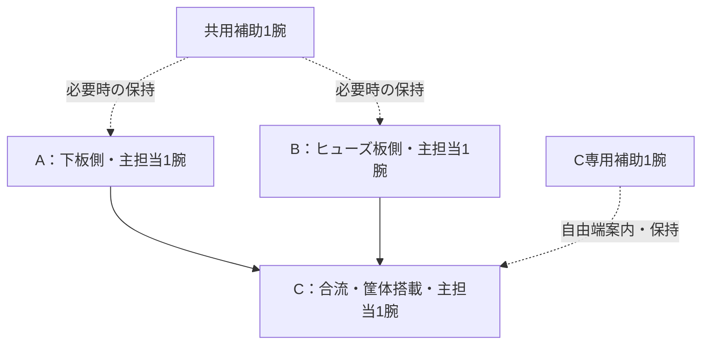

# HVJB 補助2腕の採用分担

2026-09-16。ユーザーの「補助を2腕に分ける」に基づき、直前の比較図の右側、
**S5_AB（主担当3腕＋A/B共用補助1腕＋C専用補助1腕）を役割構成として採用する。**
以降の配置・工程検討は、この5腕の分担を前提とする。

| 腕 | 担当 |
| --- | --- |
| 主担当A | 下板ユニットの外組み |
| 主担当B | ヒューズ板ユニットの外組み |
| 主担当C | 2ユニットの合流・筐体への搭載・後続組付け |
| 共用補助1 | AとBで必要になる独立保持を順番に担当 |
| 専用補助2 | Cの自由端案内・支持引継ぎを担当 |

A/Bで補助が重なる場合は、保持を始める前に順序を調整する。保持途中で共用先を
切り替えない。Cの補助は搭載後の案内・支持引継ぎまで追い、搭載終了だけで解放しない。

5腕はこの組立範囲の担当数。単腕機・双腕機などの機種と機台数、配置、移動軸、到達、
干渉、占有時間はこれから具体化する。既存の20仕事と別設備は継承する。
腕数の採用は、実機成立や最小台数の判定ではない。

決定データは`data/hvjb_robot_selection_v01.json`。
比較v01・図解v02・以前の「未採用」という記載は決定前の履歴として保存する。
次はA/Bの共用補助を使う保持区間・受渡しと、C専用補助の継続担当を具体化する。
